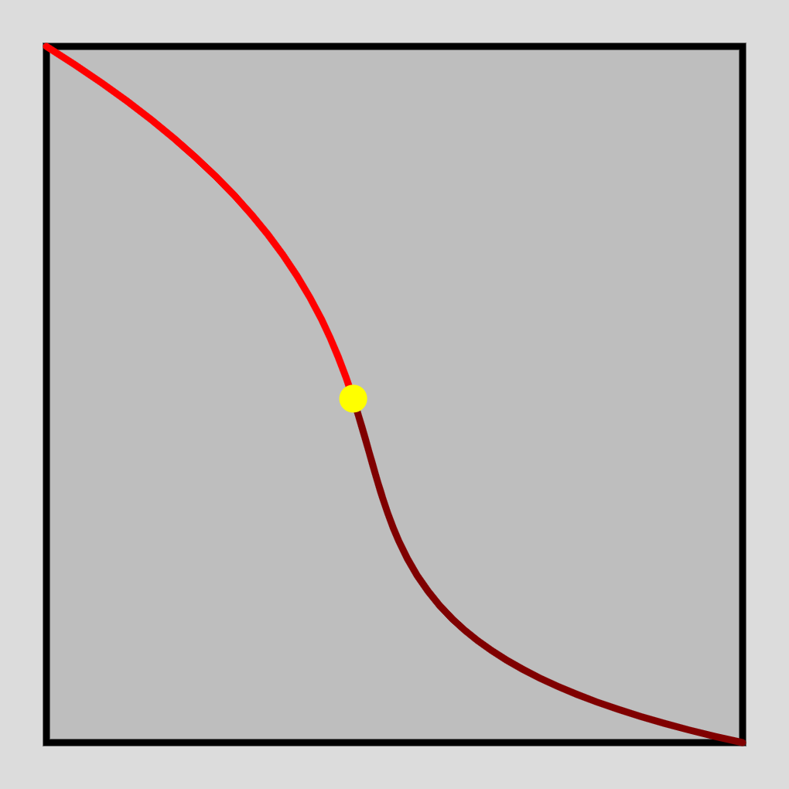
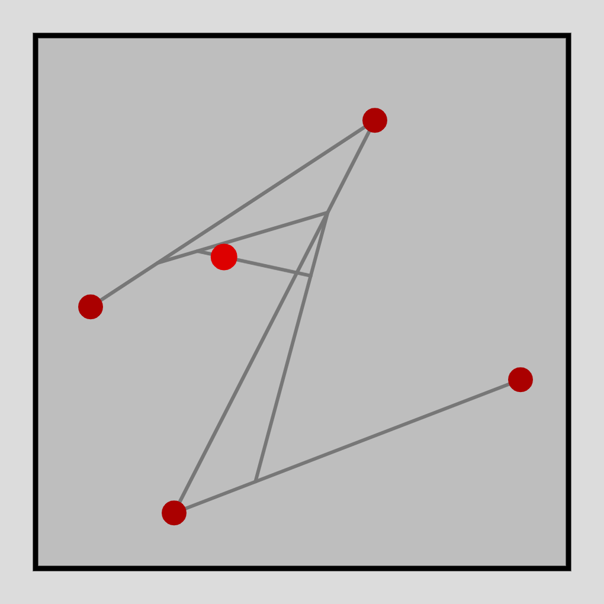
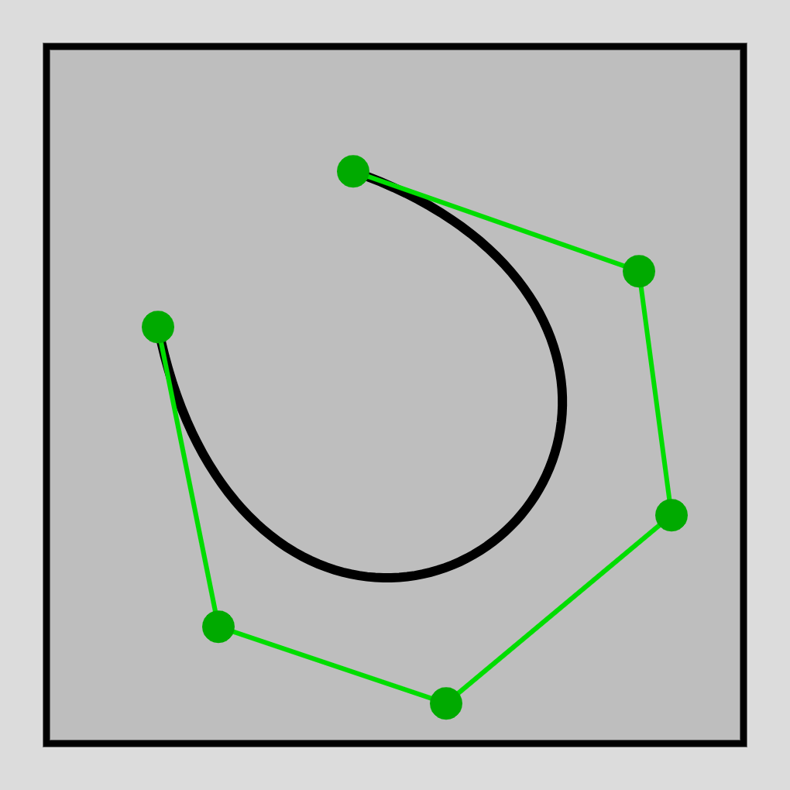

# BezierFun

This project is all about Beziers, construction and deconstruction. It uses p5js for the animations and interactivity.

## What is a Bezier?

A Bezier is a type of interpolation curve, which means you provide a set of points and the curve sort of approximates them. Specifically, you provide a start and end point and a series of control points, any of which can be arbitrarily spaced on the plane but are more often seen "between" the start and end points. The most popular type, the cubic Bezier, has $2$ control points. The curve itself is constructed by varying a parameter $0 <= t <= 1$ and forming a constituent point that is the sum of pointes weighted by an affine, binomial combination of $t$ and $1-t$. By this definition, the Bezier is a parametric curve. Each polynomial is known as a Bernstein Polynomial. 

More formally, for a cubic $B(t) = P_0t^3 + 3P_1t^2(1-t) + 3P_2t(1-t)^2 + P_3$, or in general $B(t) = \sum_{i=0}^{n}\binom {n} {i}(1-t)^{n-i}t^{i}P_i$. More astute readers may pick up that this is the algebraic interpretation of a simple geometric construction- for any appropriate $t$ simple interpolate $t$ along a line segment between a point and the next, for all pairs of consecutive points, forming a set of one fewer points. Continue the process recursively until one point remains.

## Some features of Beziers
- Towards the endpoints the tangent to the curve is almost parallel with the line connecting the endpoint to the point next to it.
- Curve is contained in convex hull of control points
- Easily rasterized by just evaluating curve at many values of $t$
- Really simple, stable, easy to compute
- Look smooth af

## Uses of Beziers
- Railway route or highway modeling, since roads need to have gradual changes
- Animation (objects move along a line with time determined by x axis and position determined by y axis)
- Computer-aided design systems and other Computer Graphics (graphics)
- Fonts (also graphics sort of)
- Trajectories of end effectors in robotics computed using Beziers
- Other fields- environment design, communications, networking, google it!

## Simple Cubic

Explores the decomposition of a cubic Bezier into 2 smaller cubic Beziers at an arbitrary rational midpoint $P$. The larger Bezier can be deformed and warped, and the two constituent Beziers will move accordingly. In this widget the user has control over a point that traverses the Bezier at its natural pace, speeding up towards the endpoints. The user can make this point move forwards and backwards. The user can also choose to display the $2$ control points.

## Higher Degree

In this widget users can add points, delete them in delete mode and move them around via click-and-drag. If two or more points are placed a "target point" $P$ appears and moves along the Bezier produced by the points on the screen at a linear rate. Keep in mind that the natural linear interpolation along the curve is itself non linear, and this will reflect on the speed of $P$.

## Curve Visualizer

Similar to the previous widget, however rather than a single point $P$ corresponding to a $t \in [0, 1]$ we see all such points in that set simultaneously. Invisible mode allows users to remove all construction points and lines to get a nice clean image, and enabling delete mode as well allows users to right click to copy or save the canvas.

## Further Reading

- [Beziers](https://en.wikipedia.org/wiki/B%C3%A9zier_curve)
- [De Casteljau's Algorithm](https://en.wikipedia.org/wiki/De_Casteljau%27s_algorithm)
- [Linear Interpolation](https://en.wikipedia.org/wiki/Linear_interpolation)
- [p5js](https://p5js.org/)
- [Bernstein Polynomial](https://en.wikipedia.org/wiki/Bernstein_polynomial)
- [Algebraic Geometry](https://en.wikipedia.org/wiki/Algebraic_geometry)